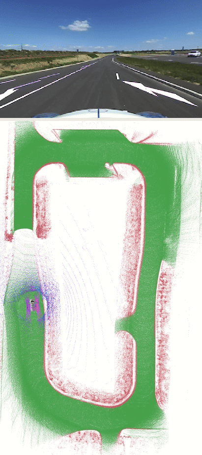
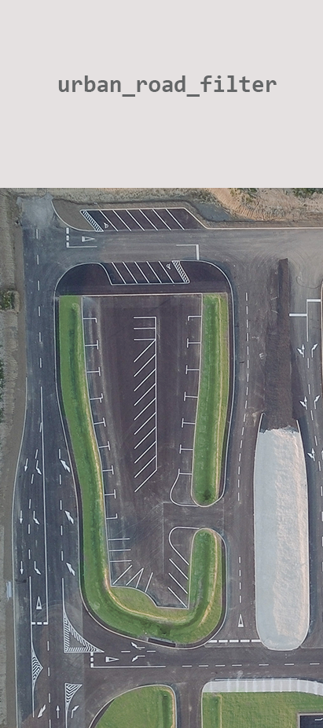

# `urban_road_filter`: a real-time LIDAR-based urban road and sidewalk detection algorithm for autonomous vehicles

 

# Dependency

- [ROS](http://wiki.ros.org/ROS/Installation) (tested with Kinetic and Melodic)
- [PCL](https://pointclouds.org/)

# Install

Use the following commands to download and compile the package.

```
cd ~/catkin_ws/src
git clone https://github.com/jkk-research/urban_road_filter
catkin build urban_road_filter
```

# Getting started

Issue the following commands to start roscore, download and play sample data, and start the algorithm with visualization. You can also watch this as a [youtube tutorial](https://www.youtube.com/watch?v=HHnj4VcbSy4).

In a **new terminal** start roscore:

```
roscore
```

In a **new terminal** go to your bag folder (e.g. `~/Downloads`):

```
cd ~/Downloads
```

Download a sample rosbag (~3,3 GB):

```r
wget https://laesze-my.sharepoint.com/:u:/g/personal/herno_o365_sze_hu/EYl_ahy5pgBBhNHt5ZkiBikBoy_j_x95E96rDtTsxueB_A?download=1 -O leaf-2021-04-23-campus.bag
```

Play rosbag:

```r
rosbag play -l ~/Downloads/leaf-2021-04-23-campus.bag
```

In a **new terminal** start the `urban_road_filter` node, `rviz` and `rqt_reconfigure` with roslaunch:

```
roslaunch urban_road_filter demo1.launch
```
